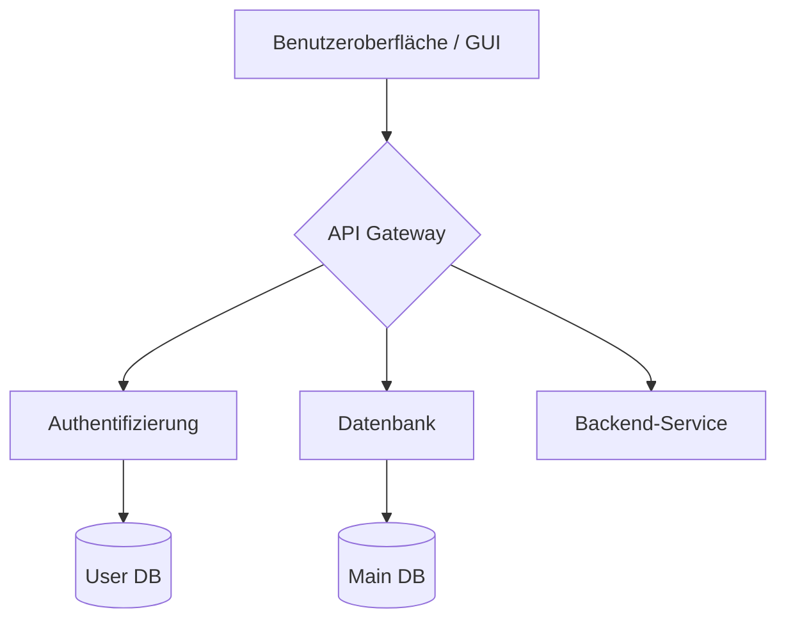

# MirrorRoblox

# 🚀 Projekt mit grafischer Oberfläche

Hier ist eine visuelle Übersicht über unsere Architektur und die aktuell geplanten Aufgaben.

## 🏗️ Systemarchitektur

Der folgende Code erzeugt auf GitHub automatisch eine grafische Darstellung deiner Systemkomponenten:

## ✅ Interaktive Checkliste
Auf GitHub kannst du mit dieser Syntax eine visuelle To-Do-Liste erstellen:

- [x] Projekt-Setup initialisieren
- [x] Grafische Benutzeroberfläche (GUI) entwerfen
- [ ] Backend-Anbindung programmieren
- [ ] Erste Beta-Version veröffentlichen

## ℹ️ Hilfe und Support
Benötigst du weitere Anpassungen? Hier findest du die [GitHub-Dokumentation](https://docs.github.com/de/get-started/writing-on-github/working-with-advanced-formatting/creating-diagrams) zu Mermaid-Diagrammen.

